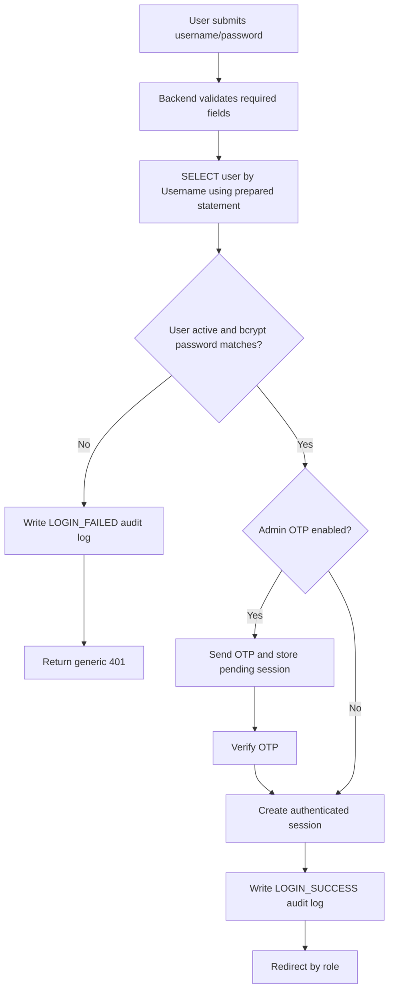
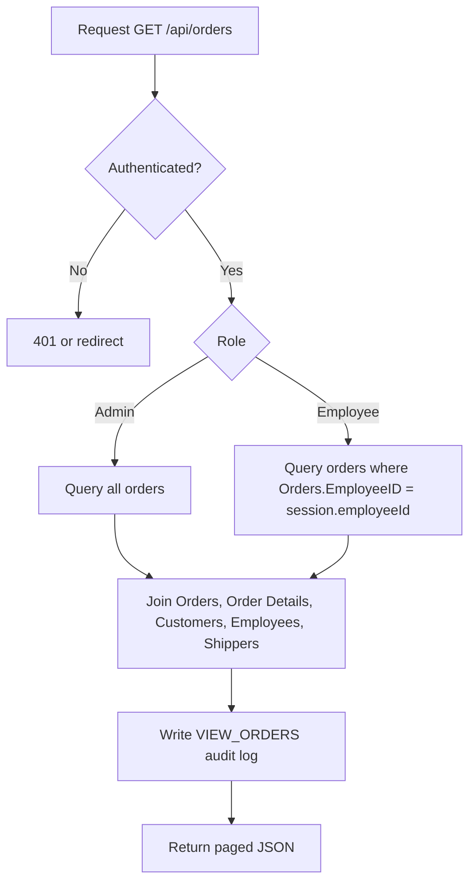
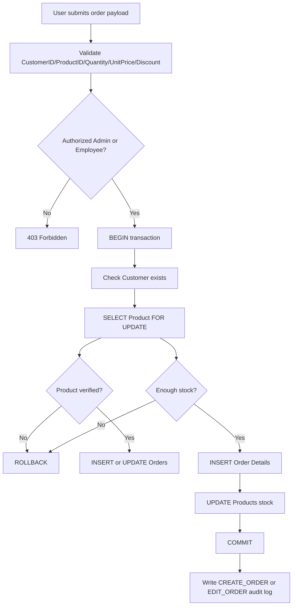
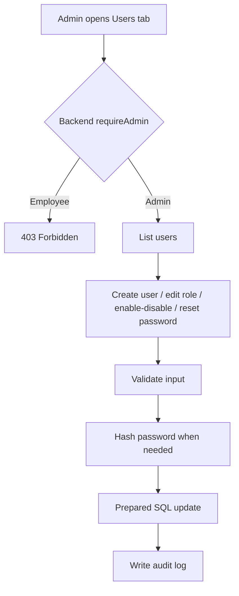
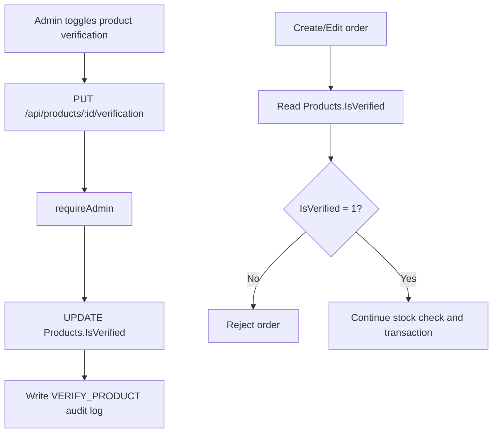
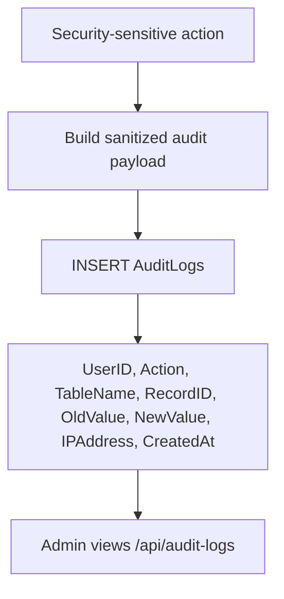

# DBS401 Flow Diagrams

## Authentication Flow

```mermaid
flowchart TD
  A[User submits username/password] --> B[Backend validates required fields]
  B --> C[SELECT user by Username using prepared statement]
  C --> D{User active and bcrypt password matches?}
  D -- No --> E[Write LOGIN_FAILED audit log]
  E --> F[Return generic 401]
  D -- Yes --> G{Admin OTP enabled?}
  G -- Yes --> H[Send OTP and store pending session]
  H --> I[Verify OTP]
  I --> J[Create authenticated session]
  G -- No --> J
  J --> K[Write LOGIN_SUCCESS audit log]
  K --> L[Redirect by role]
```

## View Orders Flow

```mermaid
flowchart TD
  A[Request GET /api/orders] --> B{Authenticated?}
  B -- No --> C[401 or redirect]
  B -- Yes --> D{Role}
  D -- Admin --> E[Query all orders]
  D -- Employee --> F[Query orders where Orders.EmployeeID = session.employeeId]
  E --> G[Join Orders, Order Details, Customers, Employees, Shippers]
  F --> G
  G --> H[Write VIEW_ORDERS audit log]
  H --> I[Return paged JSON]
```

## Add/Edit Order Flow

```mermaid
flowchart TD
  A[User submits order payload] --> B[Validate CustomerID/ProductID/Quantity/UnitPrice/Discount]
  B --> C{Authorized Admin or Employee?}
  C -- No --> D[403 Forbidden]
  C -- Yes --> E[BEGIN transaction]
  E --> F[Check Customer exists]
  F --> G[SELECT Product FOR UPDATE]
  G --> H{Product verified?}
  H -- No --> R[ROLLBACK]
  G --> I{Enough stock?}
  I -- No --> R
  H -- Yes --> J[INSERT or UPDATE Orders]
  I -- Yes --> K[INSERT Order Details]
  K --> L[UPDATE Products stock]
  L --> M[COMMIT]
  M --> N[Write CREATE_ORDER or EDIT_ORDER audit log]
```

## Admin User Management Flow

```mermaid
flowchart TD
  A[Admin opens Users tab] --> B{Backend requireAdmin}
  B -- Employee --> C[403 Forbidden]
  B -- Admin --> D[List users]
  D --> E[Create user / edit role / enable-disable / reset password]
  E --> F[Validate input]
  F --> G[Hash password when needed]
  G --> H[Prepared SQL update]
  H --> I[Write audit log]
```

## Product Verification Flow

```mermaid
flowchart TD
  A[Admin toggles product verification] --> B[PUT /api/products/:id/verification]
  B --> C[requireAdmin]
  C --> D[UPDATE Products.IsVerified]
  D --> E[Write VERIFY_PRODUCT audit log]
  F[Create/Edit order] --> G[Read Products.IsVerified]
  G --> H{IsVerified = 1?}
  H -- No --> I[Reject order]
  H -- Yes --> J[Continue stock check and transaction]
```

## Audit Logging Flow

```mermaid
flowchart TD
  A[Security-sensitive action] --> B[Build sanitized audit payload]
  B --> C[INSERT AuditLogs]
  C --> D[UserID, Action, TableName, RecordID, OldValue, NewValue, IPAddress, CreatedAt]
  D --> E[Admin views /api/audit-logs]
```
