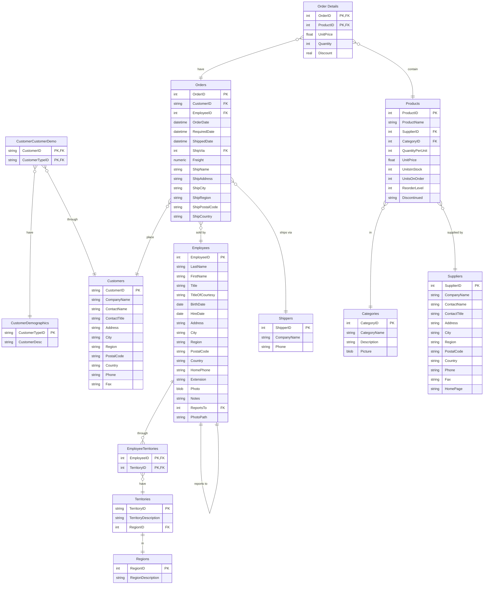

# Northwind-SQLite3

## DBS401 Secure Northwind MySQL Workbench Extension

This fork adds DBS401 security flows on top of the Northwind web app using Node.js, Express, MySQL Workbench/MySQL Server, bcrypt password hashing, role-based authorization, transactions, product verification, and audit logging.

### Run The Project

```powershell
cd app
npm install
copy .env.example .env
```

Set MySQL values in `app/.env`:

```env
DB_CLIENT=mysql
MYSQL_HOST=localhost
MYSQL_PORT=3306
MYSQL_USER=root
MYSQL_PASSWORD=123456
MYSQL_DATABASE=northwind
SESSION_SECRET=replace_with_a_long_random_secret
PORT=3001
```

Import the original SQLite data into MySQL, then apply the DBS401 security schema:

```powershell
npm run mysql:migrate
npm run security:migrate
npm start
```

Open:

```text
http://localhost:3001
```

### Demo Accounts

| Role | Username | Password |
|------|----------|----------|
| Admin | `admin` | `Admin@2024` |
| Employee | `employee` | `Employee@2024` |

Passwords are stored only as bcrypt hashes in the `Users` table.

### DBS401 Business Flows

1. **Login / Authentication**: `Users` table, bcrypt password hashes, active/disabled status, session-based login, generic failed-login errors, and audit logs for login success/failure.
2. **View Orders / Read Data Flow**: authenticated users only; Admin sees all orders; Employee sees only orders linked to their `EmployeeID`; joins `Orders`, `Order Details`, `Customers`, `Employees`, and `Shippers`.
3. **Add/Edit Order / Write-Update Data Flow**: backend authorization, input validation, product verification, stock checks, and MySQL transaction with rollback on error.
4. **Admin User Management**: Admin-only APIs and UI for listing users, creating users, editing roles, enabling/disabling users, and resetting passwords. Employee receives `403 Forbidden`.
5. **Product Verification**: `Products.IsVerified` controls whether products can be added to orders. UI displays `Verified` / `Not Verified`.
6. **Audit Logging**: `AuditLogs` table records login, order views, create/edit order, user disable/enable, password reset, product verification, and other security-relevant actions without storing passwords or secrets.

### Security Controls Added

- Prepared statements / parameterized queries through `mysql2`.
- Server-side role checks for every privileged API.
- bcrypt password hashing.
- No plain-text passwords in database or audit logs.
- Input validation for order creation/update and user management.
- MySQL transactions for order writes and stock updates.
- Safe error responses without stack traces.
- Environment-based configuration via `.env` / `.env.example`.
- Audit logging with user, action, table, record, old/new values, IP address, and timestamp.

Migration files:

- `migrations/001_create_users.sql`
- `migrations/002_create_audit_logs.sql`
- `migrations/003_product_verification.sql`

Flow diagrams are in `FLOW_DIAGRAMS.md`.

## Modern UI/UX Update

The web UI has been redesigned for a cleaner DBS401 presentation without changing the existing database schema, API routes, or server-side authorization logic.

Updated screens:

- `app/public/login.html`: centered professional login form, Northwind branding, friendly validation messages, and no technical error details.
- `app/public/dashboard.html`: Admin workspace with fixed collapsible sidebar, header, breadcrumbs, summary cards, searchable tables, order wizard, user management modals, audit log filters, toast notifications, loading states, and CSV/PDF export actions.
- `app/public/user-dashboard.html`: Employee workspace with the same visual language and read-only views for dashboard data, orders, customers, products, employees, and reports.

Main UX improvements:

- Dashboard cards for total orders, customers, products, employees, and revenue.
- Sidebar navigation with Dashboard, Orders, Customers, Products, Employees, Reports, User Management, Audit Logs, and Logout.
- Orders table with search, filters, sortable columns, pagination, row hover, View/Edit/Delete/Print actions, and role-aware backend enforcement.
- Add/Edit Order wizard with Customer, Product, Quantity, and Confirm steps.
- Product verification badges and warnings for unverified products.
- Admin User Management through modals for add/edit/reset/enable/disable flows.
- Audit Logs screen with search, date/action filters, and export actions.

See `UI_IMPROVEMENTS.md` for the UI analysis, design rationale, and detailed change list.

This is a version of the Microsoft Access 2000 Northwind sample database, re-engineered for SQLite3.

The Northwind sample database was provided with Microsoft Access as a tutorial schema for managing small business customers, orders, inventory, purchasing, suppliers, shipping, and employees. Northwind is an excellent tutorial schema for a small-business ERP, with customers, orders, inventory, purchasing, suppliers, shipping, employees, and single-entry accounting.

All the TABLES and VIEWS from the MSSQL-2000 version have been converted to Sqlite3 and included here. Included is a single version prepopulated with data. Should you decide to, you can use the included python script to pump the database full of more data.

[Download here](https://raw.githubusercontent.com/jpwhite3/northwind-SQLite3/main/dist/northwind.db)

# Structure



## Views

The following views have been converted from the original Northwind Access database. Please refer to the `src/create.sql` file to view the code behind each of these views.

| View Name |
|-----------|
| [Alphabetical list of products] |
| [Current Product List] |
| [Customer and Suppliers by City] |
| [Invoices] |
| [Orders Qry] |
| [Order Subtotals] |
| [Order Subtotals] |
| [Product Sales for 1997] |
| [Products Above Average Price] |
| [Products by Category] |
| [Quarterly Orders] |
| [Sales Totals by Amount] |
| [Summary of Sales by Quarter] |
| [Summary of Sales by Year] |
| [Category Sales for 1997] |
| [Order Details Extended] |
| [Sales by Category] |


# Build Instructions

## Prerequisites

- You are running in a unix-like environment (Linux, MacOS)
- Python 3.6 or higher (`python3 --version`)
- SQLite3 installed `sqlite3 -help`

## Build

```bash
make build  # Creates database at ./dist/northwind.db
```

## Populate with more data

```bash
make populate
```

## Print report of row counts

```bash
make report
```
